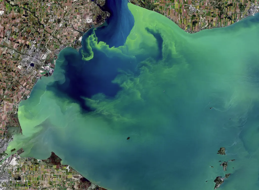

# Watershed Monitoring for Improved Freshwater Access and Incident Prevention

**Motivation**

Water has always been one of the most vital, yet alarmingly vulnerable, resources for human survival and development. In many less developed countries (LDCs), effective water management remains a significant challenge due to limitations in infrastructure and data as well as constantly changing environments. These issues affect billions worldwide and make it difficult to detect water contamination, effectively predict hydrological disasters, and ensure water remains available and affordable for those who need it.

The primary goal of this multi-faceted project is to aggregate data from a combination of satellite imagery, historical datasets, and comma-separated value (CSV) files in order to build an interface that geolocates water-related vulnerabilities and inequities. It will be easy for global citizens and governments alike to mark an area with this tool and view watershed perturbations, extreme weather risks, and discrepancies in water access. As the world is forced to accommodate more people and expend increased energy on technology, this initiative will be crucial for enabling community-level and large-scale awareness of aquatic affairs.

  

**Methodology**

To achieve the project's objectives, we will utilize advanced computer vision and machine learning techniques. The key components of our methodology include:
Data Collection and Preprocessing:
Acquire satellite imagery and street view data from sources like Google Maps and other satellite services.
Gather historical flood and drought data from the EPA and related agencies.
Preprocess the data to ensure consistency and quality for training machine learning models.
Model Development:
Computer Vision Techniques:
Implement segmentation techniques to identify and delineate regions of oil spills or algal blooms from pure water.
Use large convolution-based models (CNNs) to classify floods and droughts based on image data.
Time Series Analysis:
Apply Recurrent Neural Networks (RNNs) or Transformers to analyze timewise relationships in flood/drought data to predict future hydrological events and enable early flood/drought warning systems.
System Integration:
Develop an intuitive user interface allowing users to examine future flood or drought risk in a specific geographical region.
Integrate the ML models to provide real-time annotations and yield predictions for the flood/drought prediction.
Implement the tool as a Chrome Extension or a standalone website for ease of access.

**Use Cases**

<ins>Fishermen:</ins>
Obtain insights into water pollution and marine health to optimize where to fish.
Access to algal bloom heatmaps will ease understanding of ecological imbalances and thus mitigate overfishing.

<ins>Policy Makers/Government:</ins>
Utilize accurate data on water affordability and potability to alleviate local water shortage crises.
Monitor local precipitation and provide early-stage intervention prior to experiencing a major flood or drought.
Enforce regulations and new policies to promote sustainable water practices.

<ins>Researchers:</ins>
Analyze trends in coastline erosion and precipitation disasters exacerbated by climate change.
Develop correlational studies between flooding, algal blooms, oil spills, and overall shifts in global climate.

<ins>Environmental Agencies:</ins>
Identify regions facing water scarcity, pollution, and overuse to implement regulatory actions and provide aid.
Monitor and report on the efficiency of environmental policies and adjust as needed.
Enforce clean and sustainable water practices at both the regional and national level.

**Benefits**

<ins>Enhanced Disaster Planning:</ins> Provides precise LSTM data on flood and drought likelihoods, helping people in critical areas to plan ahead or evacuate. 

<ins>Policy Development:</ins> Supports policymakers with geographic water affordability data to address regional pipe quality and lack of access to clean water. 

<ins>Watershed Protection:</ins> Facilitates the discovery of both man-made and organic accidents like oil spills and algal blooms, leading to faster removal of contaminants. 

<ins>Environmental Monitoring:</ins> Helps record the onset of rising sea levels from global warming by using flood and drought frequency as key indices.

**Overall Goals**

<ins>Platform:</ins> Aid Analysis in working with datasets including automating data preprocessing workflows, storing datasets effectively and to be able to find similarities between them. Use relevant data stores from AWS and similar platforms. Implement a backend system including API endpoints, model integration, cloud hosting, databases, and scalability.

<ins>Analysis:</ins> Research and analyze datasets and factors for the 3 model areas - Algal Blooms/Oil Spill detection, water affordability, and Flood/Drought prediction. Determine implementation approaches for the models, while making the necessary transformations, merges, and filtering to the usable data. Follow an approach to ensure continuous improvement - Integrate prior research or basic approaches, and iteratively (1) incorporate higher concepts and findings and (2) different data sources. Ultimately, develop models that can integrate into a larger tool providing water sustainability insights.

<ins>Data Visualization:</ins> Create an intuitive user interface to allow users to select areas on a map (both land-based and marine) and view the appropriate annotations: flood/drought vulnerability, water affordability, and accident detection. This includes frontend development, visualizing patterns in our datasets, working with Maps API, and interacting with end user data.
